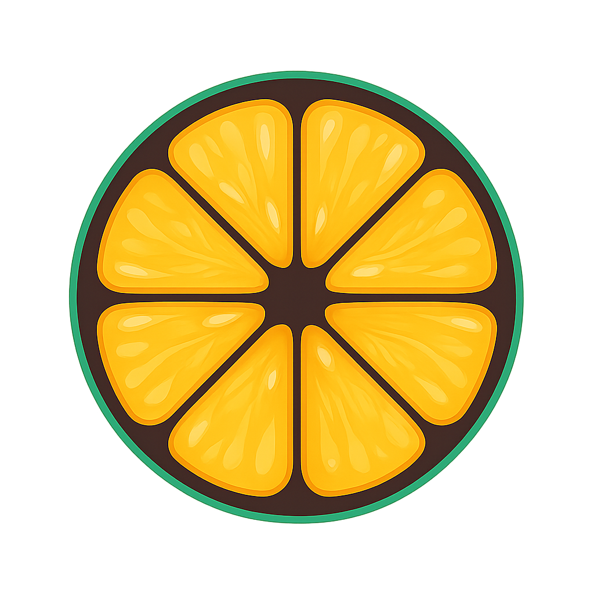

<div align="center">
  
  <h1>Nimbu</h1>
</div>

**Open source & free AI assistant for your apps**

Nimbu is a community tool that lets you chat with AI and connect it to your apps. It's not a startup - just a simple, free tool that people can use and improve together.

Currently supports Gmail, Google Docs, Calendar, Meet, and web search. More apps coming soon!

## What can you do?

- **Chat with AI** using your own OpenAI or Google AI keys
- **Connect your apps** - currently Gmail, Google Docs, Calendar, Meet
- **Ask Nimbu to do things** like "summarize my emails" or "schedule a meeting"
- **Search the web** for real-time information

## Quick start

1. **Clone and install**
```bash
git clone https://github.com/heyhexadecimal/nimbu-ai.git
cd nimbu-ai
pnpm install
```

2. **Set up environment**
```bash
# Copy the example env file and add your values
cp .env.example .env.local

# Setup database
npx prisma generate
npx prisma migrate deploy
```

3. **Run it**
```bash
pnpm dev
```

Visit `http://localhost:3000` and you're good to go!

## How it works

1. **Sign in** with Google
2. **Add your AI keys** (OpenAI or Google AI) in the app
3. **Connect apps** you want to use (Gmail, Docs, Calendar, Meet) - totally optional
4. **Start chatting** - ask Nimbu to help with your tasks

## Examples

- "What emails did I get today?"
- "Schedule a call with John tomorrow at 2pm"
- "Create a doc about our project plan"
- "What's the weather like?"

## Contributing

This is a community project! Feel free to:
- Report bugs
- Add features
- Improve the code
- Share ideas

Just fork, make changes, and send a PR.

## Tech stuff

Built with Next.js, React, TypeScript, Prisma, and LangChain. Check the code to see how everything works.

---

**Free to use, free to modify, free to improve** ✨